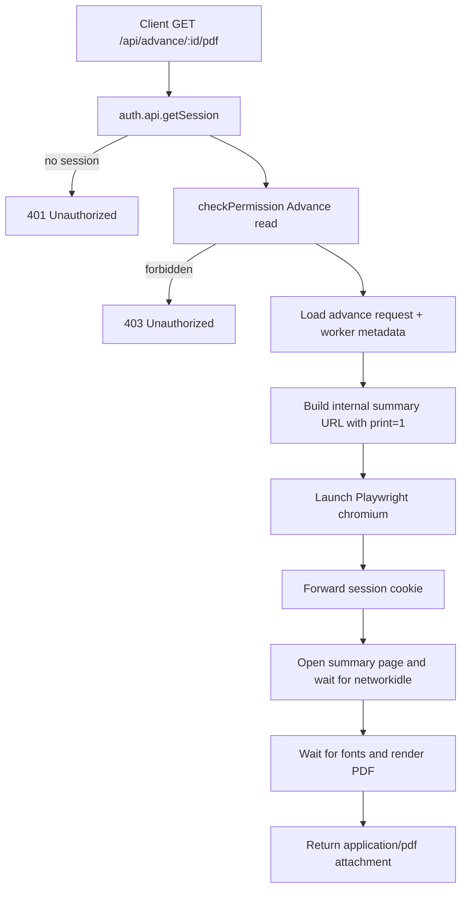
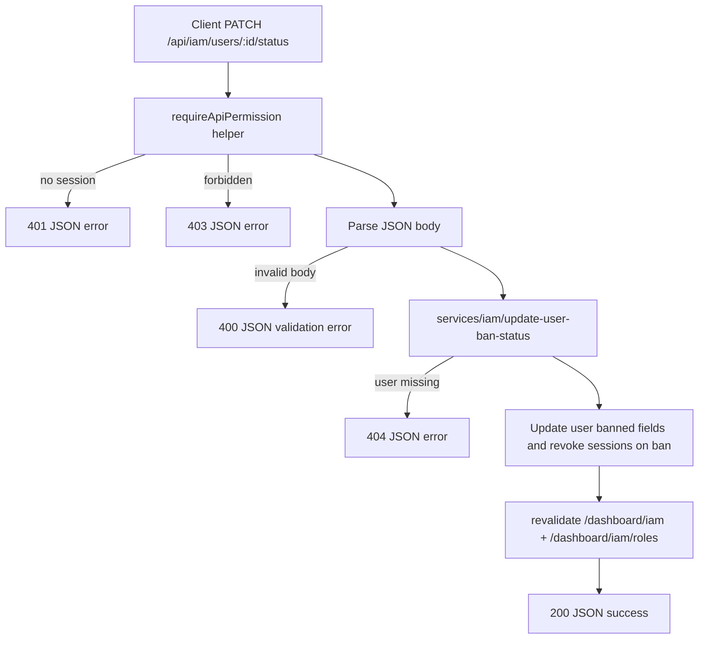
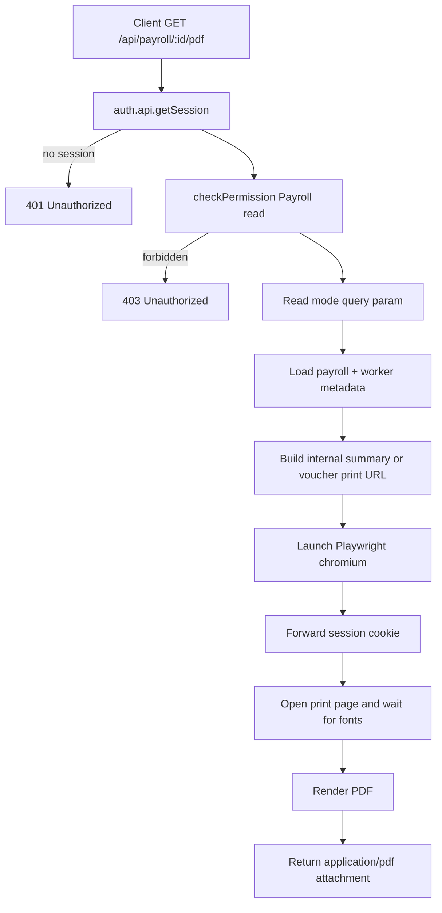
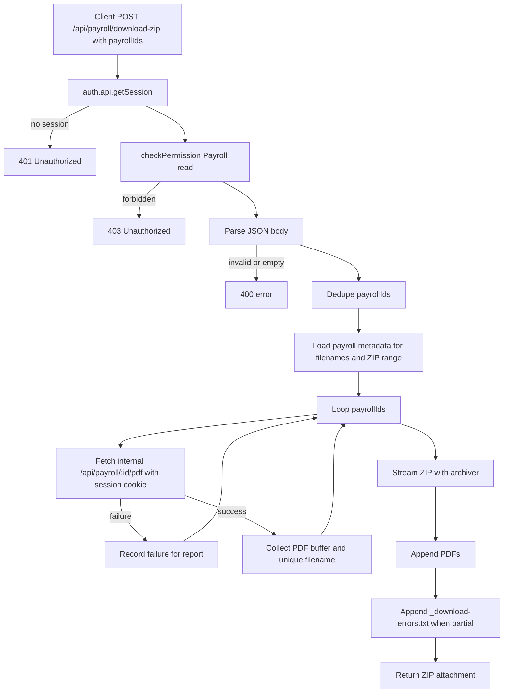

# One Laundry API Workflows

This document maps the live `app/api/` surface and its request flows.

## API Inventory

| Route | Method | Auth / permission | Purpose |
|---|---|---|---|
| `/api/auth/[...all]` | `GET`, `POST` | better-auth handler | Session, account, and auth lifecycle |
| `/api/advance/[id]/pdf` | `GET` | Session + `Advance:read` | Generate printable advance summary PDF |
| `/api/iam/users/[id]/status` | `PATCH` | Session + `IAM (Identity and Access Management):update` | Ban or unban a user from a client-triggered HTTP workflow |
| `/api/payroll/[id]/pdf` | `GET` | Session + `Payroll:read` | Generate payroll summary or voucher PDF |
| `/api/payroll/download-zip` | `POST` | Session + `Payroll:read` | Bundle multiple payroll PDFs into a ZIP |

## Auth Handler

```mermaid
flowchart TD
    A[Client calls /api/auth/[...all]] --> B[toNextJsHandler auth]
    B --> C[better-auth session or account flow]
    C --> D[HTTP response from better-auth]
```

## Advance PDF Export



## IAM User Status Command



## Payroll PDF Export



## Bulk Payroll ZIP Download



## Runtime Notes

- All document/export routes declare `runtime = "nodejs"`.
- JSON command routes should prefer the shared transport helpers in `app/api/_shared/` for auth, permission, response, and revalidation handling.
- PDF generation relies on Playwright-driven rendering of existing dashboard summary pages.
- ZIP creation fans out by calling the internal payroll PDF endpoint, so permission and print rendering logic stay centralized.
