# One Laundry API Workflows

This document maps the live `app/api/` surface and its request flows.

## API Inventory

| Route | Method | Auth / permission | Purpose |
|---|---|---|---|
| `/api/auth/[...all]` | `GET`, `POST` | better-auth handler | Session, account, and auth lifecycle |
| `/api/advance/[id]/pdf` | `GET` | Session + `Advance:read` | Generate printable advance summary PDF |
| `/api/iam/users/[id]/status` | `PATCH` | Session + `IAM (Identity and Access Management):update` | Ban or unban a user from a client-triggered HTTP workflow |
| `/api/payroll/[id]/revert-preview` | `GET` | Session + `Payroll:read` | Lazy-load the revert impact preview for the payroll detail dialog |
| `/api/payroll/[id]/revert` | `POST` | Session + `Payroll:update` | Reopen a Settled payroll and unwind timesheet + advance recovery |
| `/api/payroll/[id]/settle` | `POST` | Session + `Payroll:update` | Settle a single Draft payroll run |
| `/api/payroll/[id]/voucher-days` | `PATCH` | Session + `Payroll:update` | Update rest-day and public-holiday counts on a payroll voucher |
| `/api/payroll/[id]/pdf` | `GET` | Session + `Payroll:read` | Generate payroll summary or voucher PDF |
| `/api/payroll/download-selection` | `GET` | Session + `Payroll:read` | Lazy-load payroll rows for the download-selection dialog |
| `/api/payroll/download-zip` | `POST` | Session + `Payroll:read` | Bundle multiple payroll PDFs into a ZIP |
| `/api/payroll/settle` | `POST` | Session + `Payroll:update` | Bulk-settle multiple Draft payrolls from the settlement dialog |
| `/api/payroll/settlement-candidates` | `GET` | Session + `Payroll:read` | Lazy-load Draft payroll rows for the bulk-settlement dialog |
| `/api/timesheets/[id]` | `DELETE` | Session + `Timesheet:delete` | Delete a timesheet entry from the dashboard row-actions flow and re-sync draft payrolls |
| `/api/timesheets/import` | `POST` | Session + `Timesheet:create` | Import AttendRecord-style timesheets from the client-side import workflow and re-sync draft payrolls |
| `/api/workers/minimum-working-hours` | `PATCH` | Session + `Workers:update` | Bulk-update minimum working hours for active full-time workers and re-sync draft payrolls |

## Auth Handler

```mermaid
flowchart TD
    A[Client calls /api/auth/[...all]] --> B[toNextJsHandler auth]
    B --> C[better-auth session or account flow]
    C --> D[HTTP response from better-auth]
```

## Advance PDF Export

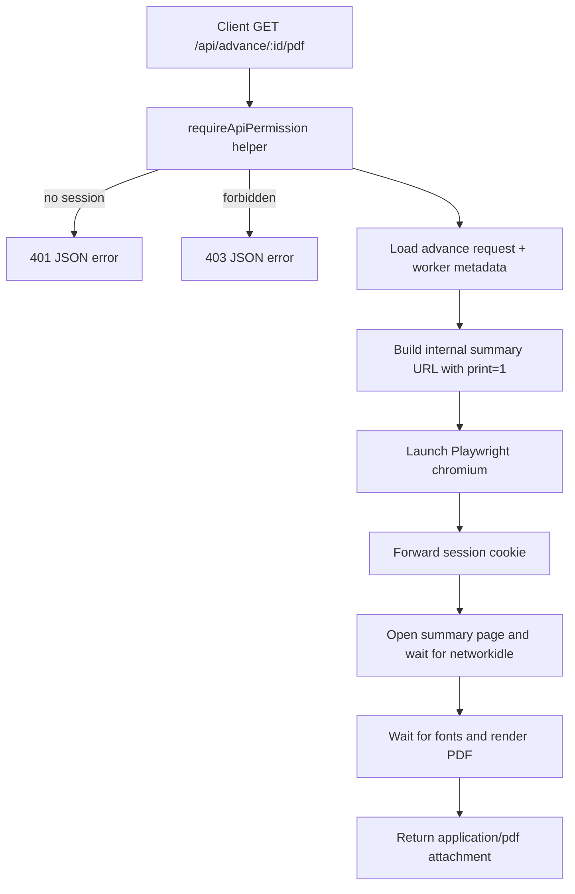
```mermaid
flowchart TD
    A[Client GET /api/advance/:id/pdf] --> B[requireApiPermission helper]
    B -->|no session| C[401 JSON error]
    B -->|forbidden| D[403 JSON error]
    B --> E[Load advance request + worker metadata]
    E --> F[Build internal summary URL with print=1]
    F --> G[Launch Playwright chromium]
    G --> H[Forward session cookie]
    H --> I[Open summary page and wait for networkidle]
    I --> J[Wait for fonts and render PDF]
    J --> K[Return application/pdf attachment]
```

## IAM User Status Command

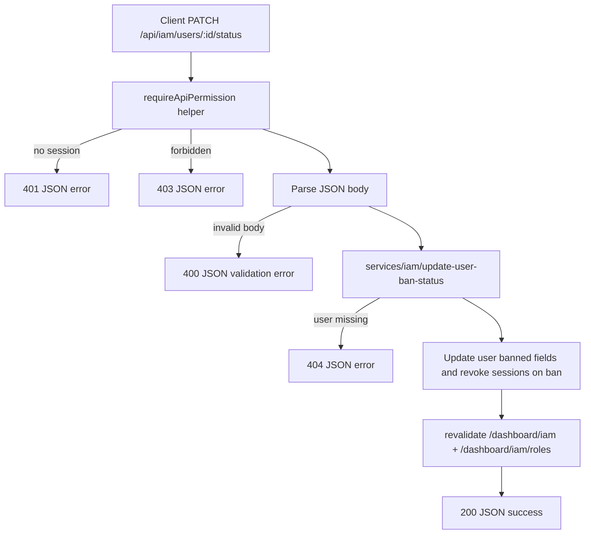
```mermaid
flowchart TD
    A[Client PATCH /api/iam/users/:id/status] --> B[requireApiPermission helper]
    B -->|no session| C[401 JSON error]
    B -->|forbidden| D[403 JSON error]
    B --> E[Parse JSON body]
    E -->|invalid body| F[400 JSON validation error]
    E --> G[services/iam/update-user-ban-status]
    G -->|user missing| H[404 JSON error]
    G --> I[Update user banned fields and revoke sessions on ban]
    I --> J[revalidate /dashboard/iam + /dashboard/iam/roles]
    J --> K[200 JSON success]
```

## Payroll PDF Export

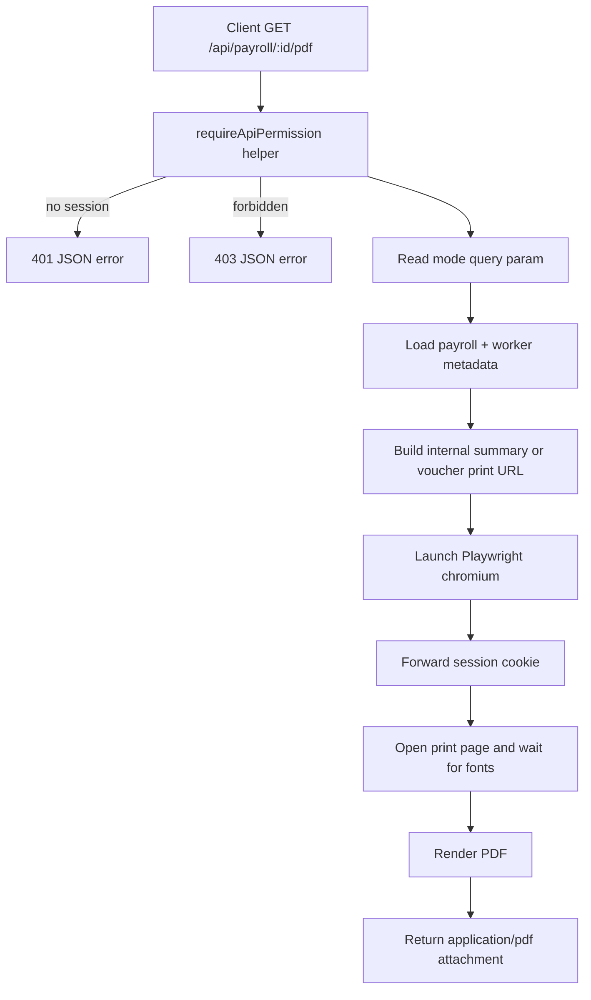
```mermaid
flowchart TD
    A[Client GET /api/payroll/:id/pdf] --> B[requireApiPermission helper]
    B -->|no session| C[401 JSON error]
    B -->|forbidden| D[403 JSON error]
    B --> E[Read mode query param]
    E --> F[Load payroll + worker metadata]
    F --> G[Build internal summary or voucher print URL]
    G --> H[Launch Playwright chromium]
    H --> I[Forward session cookie]
    I --> J[Open print page and wait for fonts]
    J --> K[Render PDF]
    K --> L[Return application/pdf attachment]
```

## Payroll Settle Command

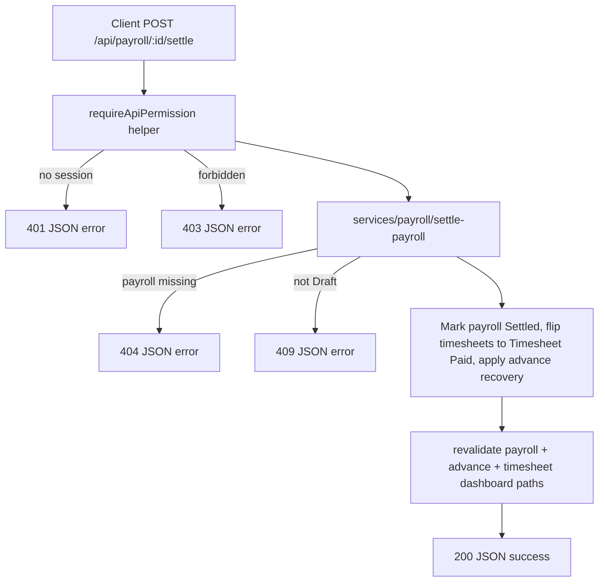
```mermaid
flowchart TD
    A[Client POST /api/payroll/:id/settle] --> B[requireApiPermission helper]
    B -->|no session| C[401 JSON error]
    B -->|forbidden| D[403 JSON error]
    B --> E[services/payroll/settle-payroll]
    E -->|payroll missing| F[404 JSON error]
    E -->|not Draft| G[409 JSON error]
    E --> H[Mark payroll Settled, flip timesheets to Timesheet Paid, apply advance recovery]
    H --> I[revalidate payroll + advance + timesheet dashboard paths]
    I --> J[200 JSON success]
```

## Payroll Revert Command

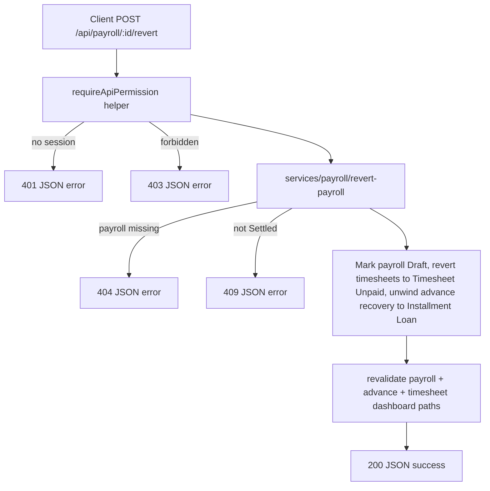
```mermaid
flowchart TD
    A[Client POST /api/payroll/:id/revert] --> B[requireApiPermission helper]
    B -->|no session| C[401 JSON error]
    B -->|forbidden| D[403 JSON error]
    B --> E[services/payroll/revert-payroll]
    E -->|payroll missing| F[404 JSON error]
    E -->|not Settled| G[409 JSON error]
    E --> H[Mark payroll Draft, revert timesheets to Timesheet Unpaid, unwind advance recovery to Installment Loan]
    H --> I[revalidate payroll + advance + timesheet dashboard paths]
    I --> J[200 JSON success]
```

## Payroll Voucher-Day Edit Command

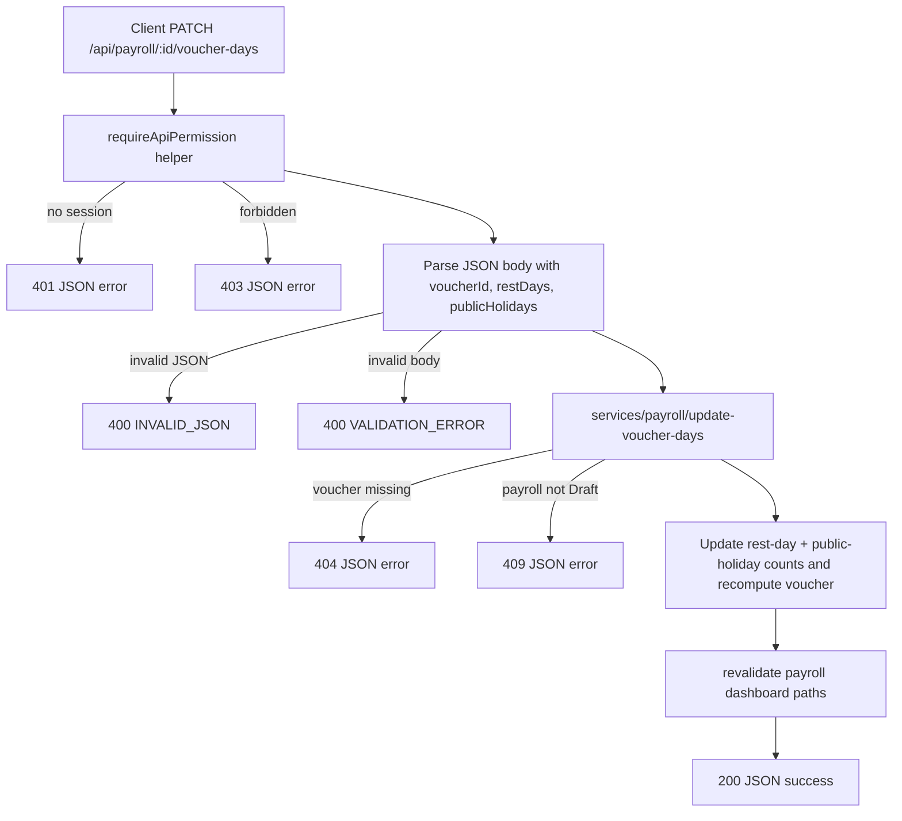
```mermaid
flowchart TD
    A[Client PATCH /api/payroll/:id/voucher-days] --> B[requireApiPermission helper]
    B -->|no session| C[401 JSON error]
    B -->|forbidden| D[403 JSON error]
    B --> E[Parse JSON body with voucherId, restDays, publicHolidays]
    E -->|invalid JSON| F[400 INVALID_JSON]
    E -->|invalid body| G[400 VALIDATION_ERROR]
    E --> H[services/payroll/update-voucher-days]
    H -->|voucher missing| I[404 JSON error]
    H -->|payroll not Draft| J[409 JSON error]
    H --> K[Update rest-day + public-holiday counts and recompute voucher]
    K --> L[revalidate payroll dashboard paths]
    L --> M[200 JSON success]
```

## Payroll Bulk Settle Command

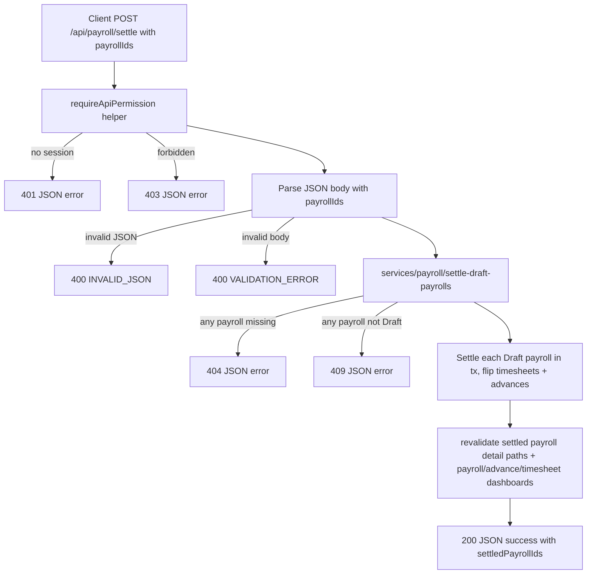
```mermaid
flowchart TD
    A[Client POST /api/payroll/settle with payrollIds] --> B[requireApiPermission helper]
    B -->|no session| C[401 JSON error]
    B -->|forbidden| D[403 JSON error]
    B --> E[Parse JSON body with payrollIds]
    E -->|invalid JSON| F[400 INVALID_JSON]
    E -->|invalid body| G[400 VALIDATION_ERROR]
    E --> H[services/payroll/settle-draft-payrolls]
    H -->|any payroll missing| I[404 JSON error]
    H -->|any payroll not Draft| J[409 JSON error]
    H --> K[Settle each Draft payroll in tx, flip timesheets + advances]
    K --> L[revalidate settled payroll detail paths + payroll/advance/timesheet dashboards]
    L --> M[200 JSON success with settledPayrollIds]
```

## Payroll Revert Preview Read

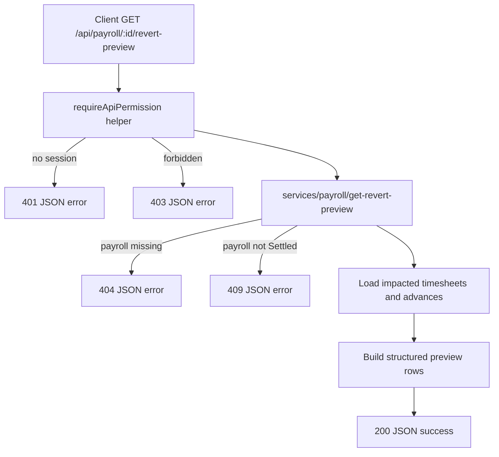
```mermaid
flowchart TD
    A[Client GET /api/payroll/:id/revert-preview] --> B[requireApiPermission helper]
    B -->|no session| C[401 JSON error]
    B -->|forbidden| D[403 JSON error]
    B --> E[services/payroll/get-revert-preview]
    E -->|payroll missing| F[404 JSON error]
    E -->|payroll not Settled| G[409 JSON error]
    E --> H[Load impacted timesheets and advances]
    H --> I[Build structured preview rows]
    I --> J[200 JSON success]
```

## Payroll Settlement Candidates Read

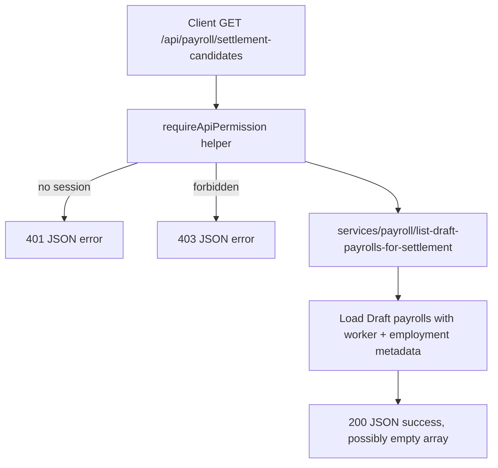
```mermaid
flowchart TD
    A[Client GET /api/payroll/settlement-candidates] --> B[requireApiPermission helper]
    B -->|no session| C[401 JSON error]
    B -->|forbidden| D[403 JSON error]
    B --> E[services/payroll/list-draft-payrolls-for-settlement]
    E --> F[Load Draft payrolls with worker + employment metadata]
    F --> G[200 JSON success, possibly empty array]
```

## Payroll Download Selection Read

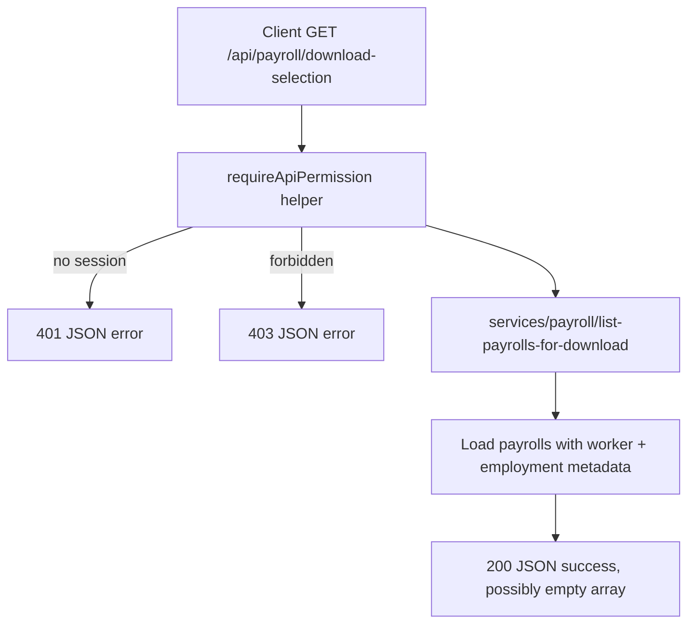
```mermaid
flowchart TD
    A[Client GET /api/payroll/download-selection] --> B[requireApiPermission helper]
    B -->|no session| C[401 JSON error]
    B -->|forbidden| D[403 JSON error]
    B --> E[services/payroll/list-payrolls-for-download]
    E --> F[Load payrolls with worker + employment metadata]
    F --> G[200 JSON success, possibly empty array]
```

## Timesheet Delete Command

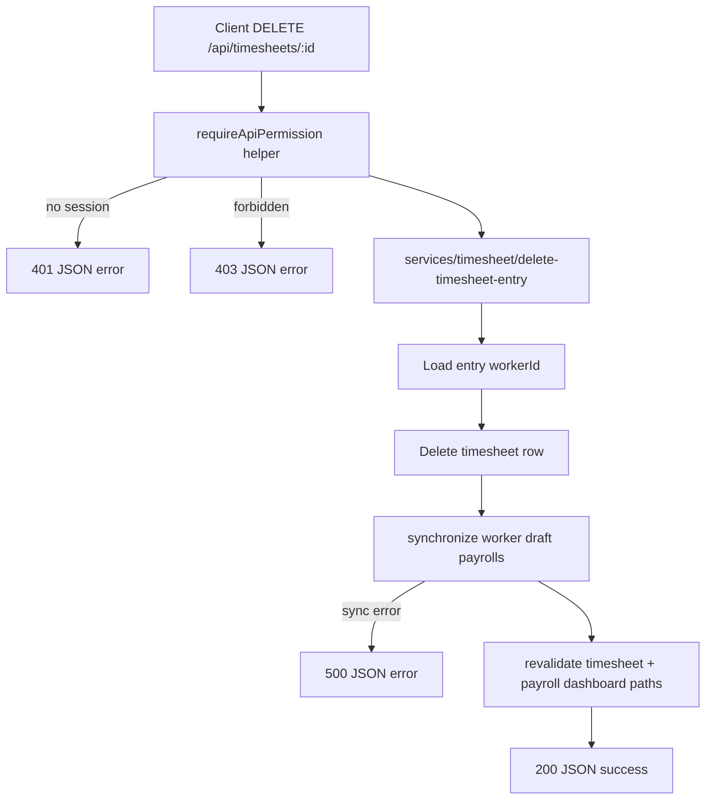
```mermaid
flowchart TD
    A[Client DELETE /api/timesheets/:id] --> B[requireApiPermission helper]
    B -->|no session| C[401 JSON error]
    B -->|forbidden| D[403 JSON error]
    B --> E[services/timesheet/delete-timesheet-entry]
    E --> F[Load entry workerId]
    F --> G[Delete timesheet row]
    G --> H[synchronize worker draft payrolls]
    H -->|sync error| I[500 JSON error]
    H --> J[revalidate timesheet + payroll dashboard paths]
    J --> K[200 JSON success]
```

## Timesheet AttendRecord Import

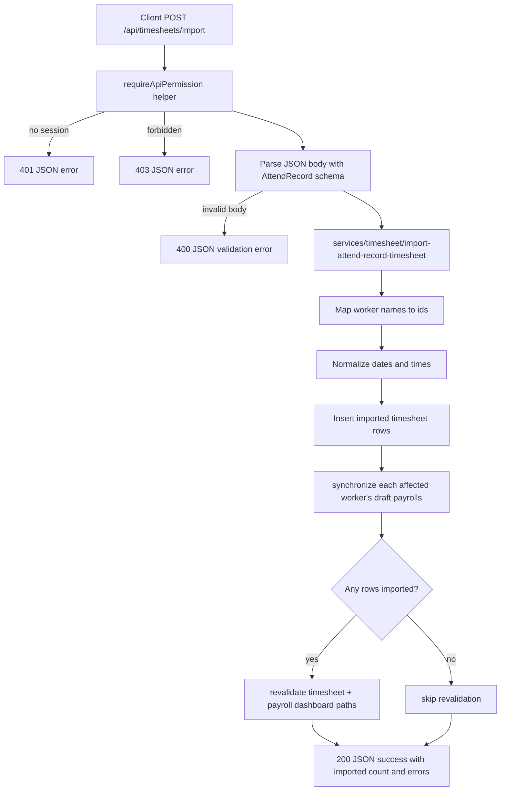
```mermaid
flowchart TD
    A[Client POST /api/timesheets/import] --> B[requireApiPermission helper]
    B -->|no session| C[401 JSON error]
    B -->|forbidden| D[403 JSON error]
    B --> E[Parse JSON body with AttendRecord schema]
    E -->|invalid body| F[400 JSON validation error]
    E --> G[services/timesheet/import-attend-record-timesheet]
    G --> H[Map worker names to ids]
    H --> I[Normalize dates and times]
    I --> J[Insert imported timesheet rows]
    J --> K[synchronize each affected worker's draft payrolls]
    K --> L{Any rows imported?}
    L -->|yes| M[revalidate timesheet + payroll dashboard paths]
    L -->|no| N[skip revalidation]
    M --> O[200 JSON success with imported count and errors]
    N --> O
```

## Worker Minimum-Hours Bulk Update

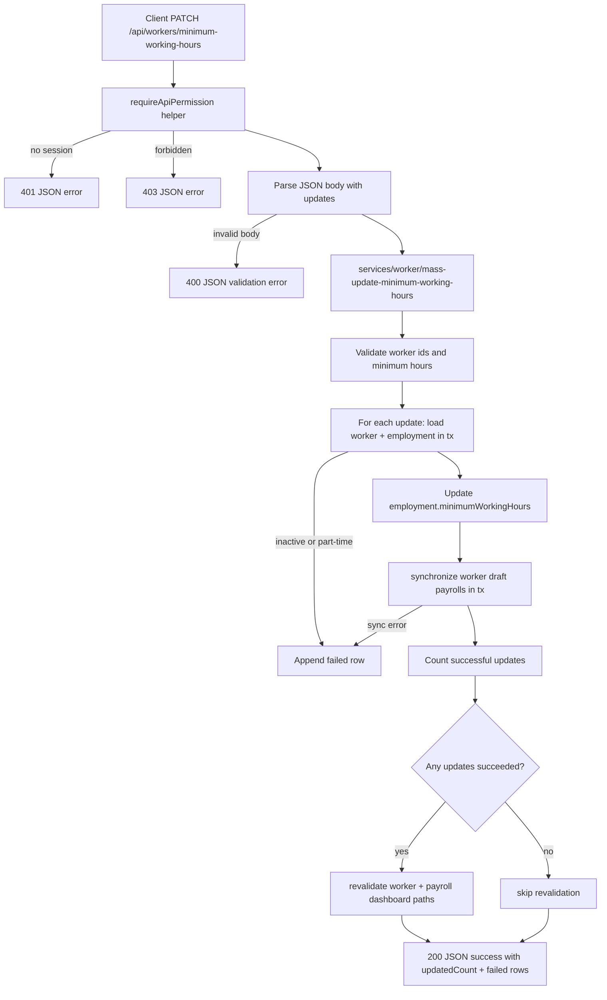
```mermaid
flowchart TD
    A[Client PATCH /api/workers/minimum-working-hours] --> B[requireApiPermission helper]
    B -->|no session| C[401 JSON error]
    B -->|forbidden| D[403 JSON error]
    B --> E[Parse JSON body with updates]
    E -->|invalid body| F[400 JSON validation error]
    E --> G[services/worker/mass-update-minimum-working-hours]
    G --> H[Validate worker ids and minimum hours]
    H --> I[For each update: load worker + employment in tx]
    I -->|inactive or part-time| J[Append failed row]
    I --> K[Update employment.minimumWorkingHours]
    K --> L[synchronize worker draft payrolls in tx]
    L -->|sync error| J
    L --> M[Count successful updates]
    M --> N{Any updates succeeded?}
    N -->|yes| O[revalidate worker + payroll dashboard paths]
    N -->|no| P[skip revalidation]
    O --> Q[200 JSON success with updatedCount + failed rows]
    P --> Q
```

## Bulk Payroll ZIP Download

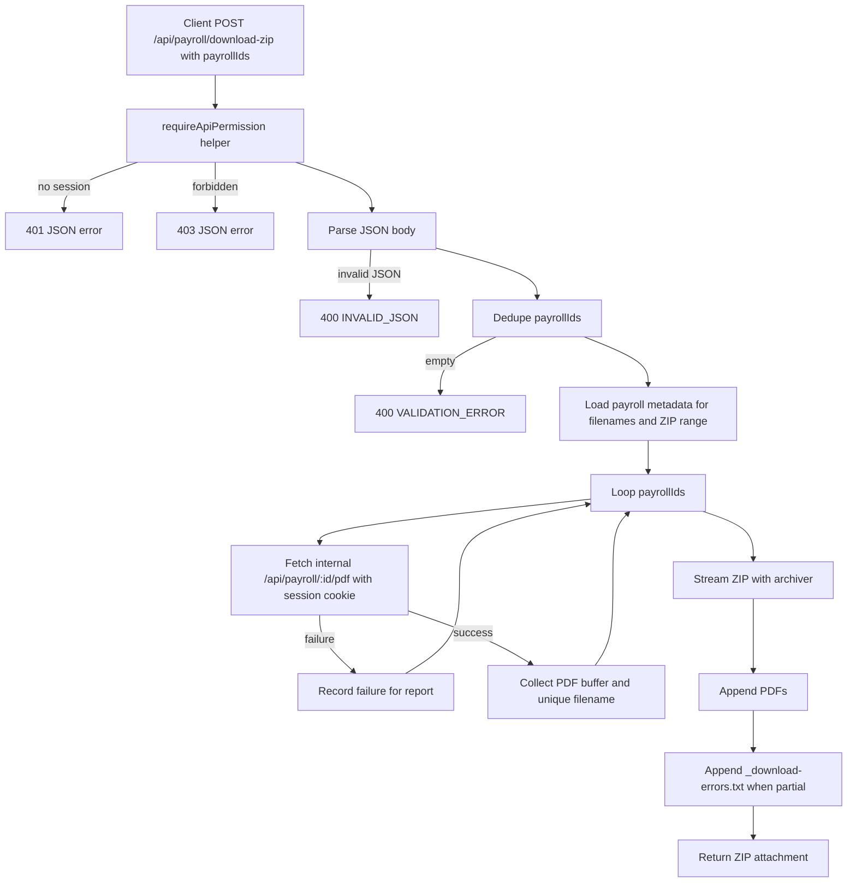
```mermaid
flowchart TD
    A[Client POST /api/payroll/download-zip with payrollIds] --> B[requireApiPermission helper]
    B -->|no session| C[401 JSON error]
    B -->|forbidden| D[403 JSON error]
    B --> E[Parse JSON body]
    E -->|invalid JSON| F[400 INVALID_JSON]
    E --> G[Dedupe payrollIds]
    G -->|empty| H[400 VALIDATION_ERROR]
    G --> I[Load payroll metadata for filenames and ZIP range]
    I --> J[Loop payrollIds]
    J --> K[Fetch internal /api/payroll/:id/pdf with session cookie]
    K -->|failure| L[Record failure for report]
    K -->|success| M[Collect PDF buffer and unique filename]
    M --> J
    L --> J
    J --> N[Stream ZIP with archiver]
    N --> O[Append PDFs]
    O --> P[Append _download-errors.txt when partial]
    P --> Q[Return ZIP attachment]
```

## Runtime Notes

- All document/export routes declare `runtime = "nodejs"`.
- JSON command routes should prefer the shared transport helpers in `app/api/_shared/` for auth, permission, response, and revalidation handling.
- Bulk worker minimum-hours updates stay action-free on the client side: the dashboard dialog calls the route, while worker create and edit forms remain server-action submissions.
- Payroll revert preview, bulk settlement candidate loading, payroll download selection, payroll settle/revert commands, voucher-day edits, and export flows now run through `app/api`; only payroll create and update remain server-action form submissions.
- Timesheet delete and AttendRecord import now call `app/api` from client components, while timesheet create and edit remain server-action submissions.
- PDF generation relies on Playwright-driven rendering of existing dashboard summary pages.
- ZIP creation fans out by calling the internal payroll PDF endpoint, so permission and print rendering logic stay centralized.
