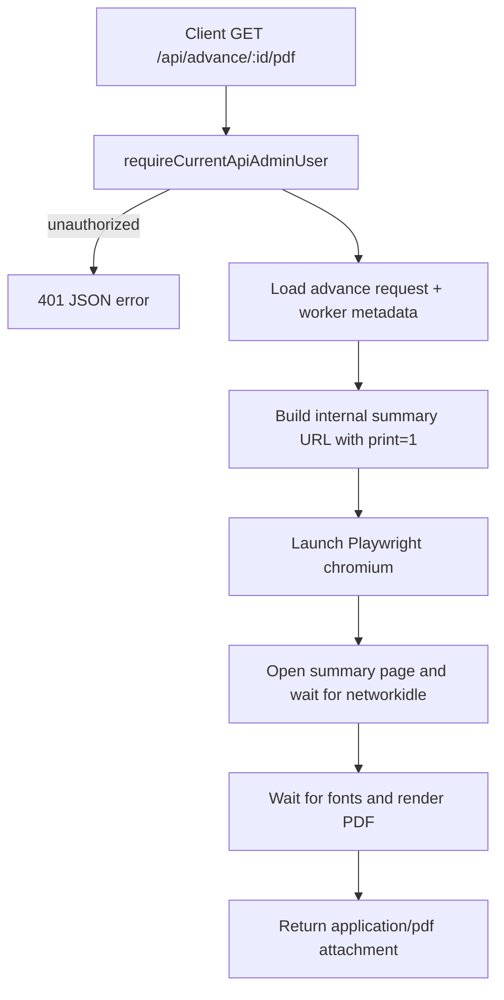
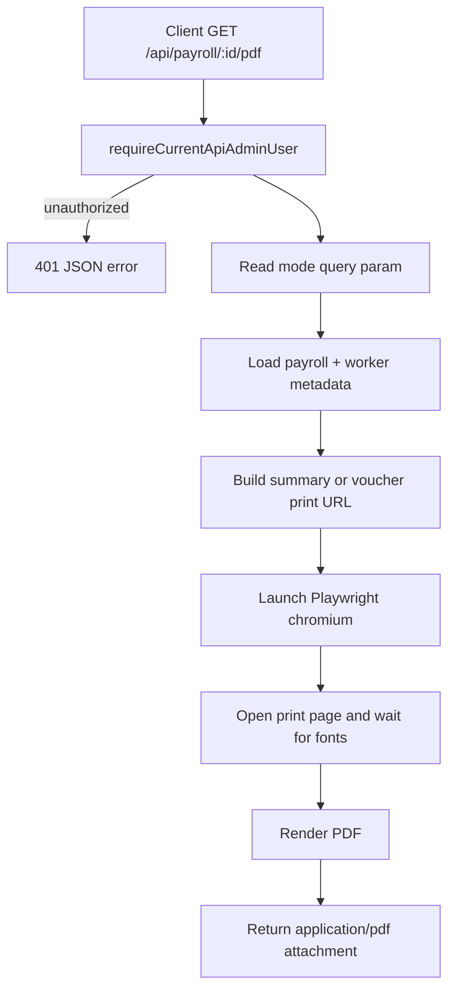
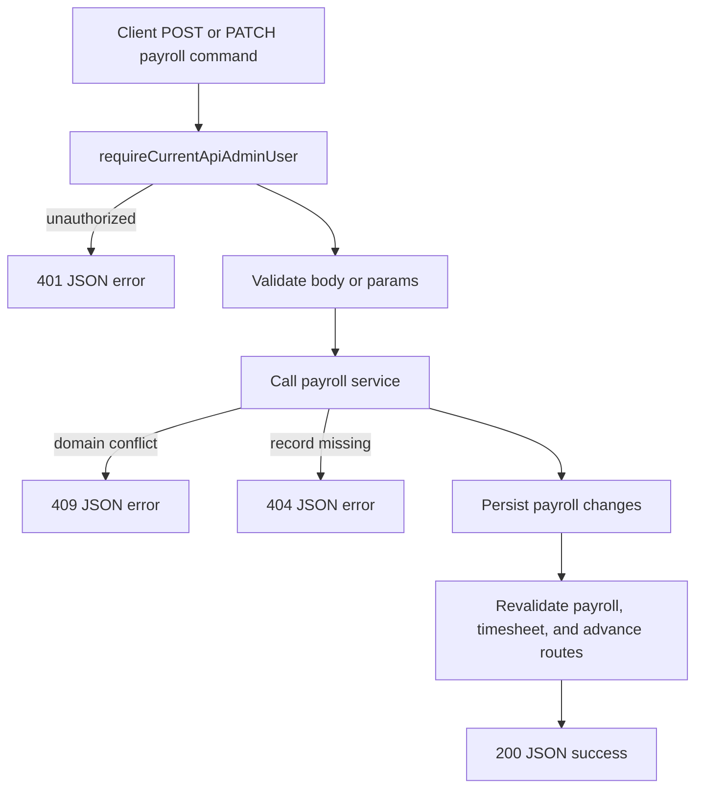
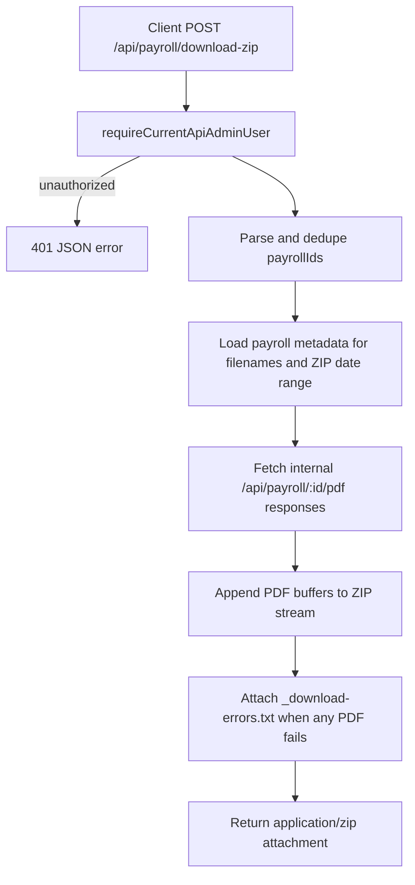

# One Laundry API Workflows

This document maps the live `app/api/` surface after the single-admin Supabase auth rollout.

## API Inventory

| Route | Method | Access model | Purpose |
|---|---|---|---|
| `/api/advance/[id]/pdf` | `GET` | Admin session required | Generate printable advance summary PDF |
| `/api/payroll/[id]/revert-preview` | `GET` | Admin session required | Lazy-load the revert impact preview for the payroll detail dialog |
| `/api/payroll/[id]/revert` | `POST` | Admin session required | Reopen a Settled payroll and unwind timesheet + advance recovery |
| `/api/payroll/[id]/settle` | `POST` | Admin session required | Settle a single Draft payroll run |
| `/api/payroll/[id]/voucher-days` | `PATCH` | Admin session required | Update rest-day and public-holiday counts on a payroll voucher |
| `/api/payroll/[id]/pdf` | `GET` | Admin session required | Generate payroll summary or voucher PDF |
| `/api/payroll/download-selection` | `GET` | Admin session required | Lazy-load payroll rows for the download-selection dialog |
| `/api/payroll/download-zip` | `POST` | Admin session required | Bundle multiple payroll PDFs into a ZIP |
| `/api/payroll/settle` | `POST` | Admin session required | Bulk-settle multiple Draft payrolls from the settlement dialog |
| `/api/payroll/settlement-candidates` | `GET` | Admin session required | Lazy-load Draft payroll rows for the bulk-settlement dialog |
| `/api/timesheets/[id]` | `DELETE` | Admin session required | Delete a timesheet entry from row actions and re-sync draft payrolls |
| `/api/timesheets/import` | `POST` | Admin session required | Import AttendRecord-style timesheets and re-sync draft payrolls |
| `/api/workers/minimum-working-hours` | `PATCH` | Admin session required | Bulk-update minimum working hours for active full-time workers and re-sync draft payrolls |

## Access Contract

- Every live route performs an explicit admin-session check through `requireCurrentApiAdminUser()`.
- Unauthenticated or non-admin API callers receive `401` JSON shaped as `{ ok: false, error: { code: "UNAUTHORIZED", message: "Authentication required" } }`.
- Protected dashboard page requests redirect into `/login`; protected API routes do not issue HTML redirects.

## Advance PDF Export

## Payroll PDF Export

## Payroll Mutation Pattern

## Timesheet Import Pattern

## ZIP Payroll Export

## Runtime Notes

- All document/export routes declare `runtime = "nodejs"`.
- JSON command routes prefer the shared transport helpers in `app/api/_shared/` for admin-session enforcement, response shaping, and revalidation handling.
- Bulk worker minimum-hours updates stay action-free on the client side: the dashboard dialog calls the route, while worker create and edit forms remain server-action submissions.
- Payroll revert preview, bulk settlement candidate loading, payroll download selection, payroll settle/revert commands, voucher-day edits, and export flows now run through `app/api`; only payroll create and update remain server-action form submissions.
- Timesheet delete and AttendRecord import now call `app/api` from client components, while timesheet create and edit remain server-action submissions.
- Dashboard form submissions still perform their own `requireCurrentDashboardAdminUser()` check, so route protection does not rely on `proxy.ts` alone.
- PDF generation relies on Playwright-driven rendering of existing dashboard summary pages.
- ZIP creation fans out by calling the internal payroll PDF endpoint, so print rendering logic stays centralized.
