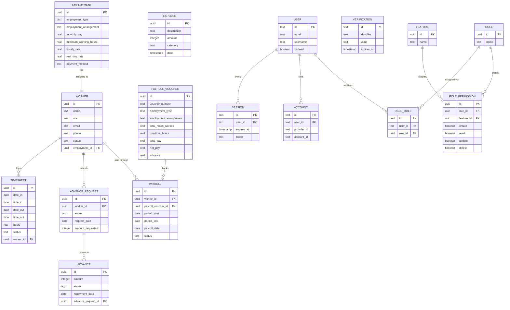

# One Laundry Data Model ERD

This ERD documents the live Drizzle/Postgres model across payroll operations, IAM, auth, and expenses.

## Mermaid ERD

## Notes

- `expenses` is currently standalone and does not link to `worker` or `payroll`.
- `verification` is standalone support data for auth flows.
- App logic treats `payroll` and `payroll_voucher` as one voucher per payroll run, but the current schema stores the foreign key on `payroll` without a unique constraint on `payroll_voucher_id`.

## Status Enums

- `worker_status`: `Active`, `Inactive`
- `timesheet_payment_status`: `Timesheet Unpaid`, `Timesheet Paid`
- `advance_loan_status`: `Advance Loan`, `Advance Paid`
- `installment_status`: `Installment Loan`, `Installment Paid`
- `payroll_status`: `Draft`, `Settled`
