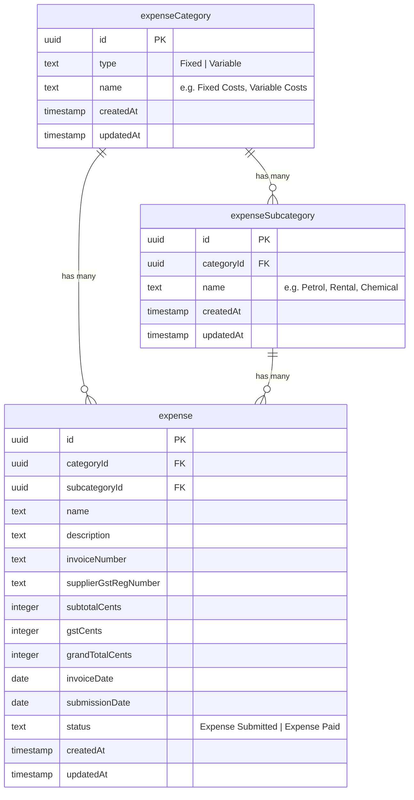

# Expenses Feature Build

## Problem Statement

The current expenses feature is a stub: a flat `expensesTable` with only `description`, `amount`, `category` (free-text), and `date`. No form, no edit, no categories table, no status lifecycle, no GST fields, and no API tests.

The goal is to build a production-quality expenses module with:

- **Structured categories**: two default types (Fixed, Variable) with user-created subcategories
- **Rich expense records**: name, description, invoice number, supplier GST reg number, subtotal, GST, grand total, invoice date, submission date, status (Submitted / Paid)
- **Full CRUD**: create, edit, view via DataTable
- **Dashboard**: overview cards and breakdowns by category/subcategory
- **Type safety**: Drizzle tables -> drizzle-zod schemas -> forms + API bodies
- **Testing**: unit + integration tests for all API routes

---

## Solution

Replace the stub with a three-table schema (categories -> subcategories -> expenses) plus server actions, API routes, and frontend pages following existing codebase patterns (advance feature as primary reference).

---

## Data Model

Monetary values stored as integer cents (consistent with existing `amount` columns in payroll/advance).

---

## Commits (incremental, each leaves codebase working)

### Commit 1: Domain vocabulary update

- Update `UBIQUITOUS_LANGUAGE.md` Expenses section with new terms: **Expense Category**, **Expense Category Type** (Fixed / Variable), **Expense Subcategory**, **Expense Status** (Expense Submitted / Expense Paid), **Invoice Date**, **Submission Date**, **Subtotal**, **GST**, **Grand Total**, **Supplier GST Registration Number**.

### Commit 2: Status enum, category table, and subcategory table

- Add `expenseStatusEnum` to `[db/tables/statusEnums.ts](db/tables/statusEnums.ts)` with values `["Expense Submitted", "Expense Paid"]`
- Add `ExpenseStatus` type and `EXPENSE_CATEGORY_TYPES` const to `[types/status.ts](types/status.ts)`
- Create `[db/tables/expenseCategoryTable.ts](db/tables/expenseCategoryTable.ts)`: `id`, `type` (text enum: Fixed/Variable), `name`, `createdAt`, `updatedAt`
- Create `[db/tables/expenseSubcategoryTable.ts](db/tables/expenseSubcategoryTable.ts)`: `id`, `categoryId` FK -> `expenseCategoryTable.id`, `name`, `createdAt`, `updatedAt`
- Export both from `[db/schema.ts](db/schema.ts)`

### Commit 3: Replace expenses table

- Rewrite `[db/tables/expensesTable.ts](db/tables/expensesTable.ts)` with the full schema: `**categoryId` FK** -> `expenseCategoryTable.id`, `**subcategoryId`FK** ->`expenseSubcategoryTable.id`, `name`, `description`, `invoiceNumber`, `supplierGstRegNumber`, `subtotalCents`, `gstCents`, `grandTotalCents`, `invoiceDate`, `submissionDate`, `status`, `createdAt`, `updatedAt`
- Run `npm run db:migrate` to push schema

### Commit 4: Zod schemas (drizzle-zod)

- Create `[db/schemas/expense-category.ts](db/schemas/expense-category.ts)` with `expenseCategoryFormSchema` and `expenseSubcategoryFormSchema`
- Create `[db/schemas/expense.ts](db/schemas/expense.ts)` with `expenseFormSchema` (validates subtotal/GST/grand total relationship, dates, **both** `categoryId` and `subcategoryId` required, and `**subcategoryId` must belong to `categoryId`\*\* via `superRefine` using loaded subcategory rows or a small lookup map passed into parse context)

### Commit 5: API routes for expense categories and subcategories

- `POST /api/expenses/categories` - create category
- `GET /api/expenses/categories` - list all categories (with nested subcategories)
- `PATCH /api/expenses/categories/[id]` - update category
- `DELETE /api/expenses/categories/[id]` - delete category (only if no subcategories reference it)
- `POST /api/expenses/subcategories` - create subcategory (body includes `categoryId`)
- `PATCH /api/expenses/subcategories/[id]` - update subcategory
- `DELETE /api/expenses/subcategories/[id]` - delete subcategory (only if no expenses reference it)
- All routes use `requireCurrentApiUser()`, `apiSuccess()`, `apiError()` from `app/api/_shared/`

### Commit 6: API route tests for categories and subcategories

- Unit tests for each category and subcategory CRUD endpoint using the existing mock pattern (`vi.mock`, `mockAuthenticatedApiOperator`)
- Test auth guard, validation, happy paths, and conflict (delete with linked children)

### Commit 7: Server actions for expenses CRUD

- `[app/dashboard/expenses/new/actions.ts](app/dashboard/expenses/new/actions.ts)` - `createExpense`
- `[app/dashboard/expenses/[id]/edit/actions.ts](app/dashboard/expenses/[id]/edit/actions.ts)` - `updateExpense`
- Validate with `expenseFormSchema`, call service layer, `revalidatePath`

### Commit 8: API routes for expenses

- `GET /api/expenses` - list expenses (with optional category filter)
- `GET /api/expenses/[id]` - single expense detail
- `PATCH /api/expenses/[id]/status` - transition status (Submitted -> Paid)
- All use shared auth + response helpers

### Commit 9: API route tests for expenses

- Unit tests for expenses list, detail, and status transition
- Test validation, auth, 404 handling, **reject category/subcategory mismatch** where applicable

### Commit 10: Expense form component

- Create `[app/dashboard/expenses/expense-form.tsx](app/dashboard/expenses/expense-form.tsx)` using react-hook-form + zodResolver
- Fields: name, description, invoice number, supplier GST reg, subtotal (auto-calc GST + grand total with manual override toggle), invoice date, submission date, cascading category -> subcategory dropdowns
- Reuse existing UI primitives: `Field`, `FieldGroup`, `FieldLabel`, `FieldError`, `Input`, `DatePickerInput`, `SelectSearch`, `Card`

### Commit 11: Category and subcategory management page

- Create `[app/dashboard/expenses/categories/page.tsx](app/dashboard/expenses/categories/page.tsx)` - list/create/edit/delete categories and their subcategories inline (similar to public-holidays management pattern)
- Subcategories displayed nested under their parent category with add/edit/delete controls
- Add to nav sub-features

### Commit 12: New expense and edit pages

- Wire `[app/dashboard/expenses/new/page.tsx](app/dashboard/expenses/new/page.tsx)` with the expense form (create mode)
- Create `[app/dashboard/expenses/[id]/edit/page.tsx](app/dashboard/expenses/[id]/edit/page.tsx)` (edit mode, pre-fills data)
- Create `[app/dashboard/expenses/[id]/page.tsx](app/dashboard/expenses/[id]/page.tsx)` for detail view

### Commit 13: DataTable columns update

- Rewrite `[app/dashboard/expenses/columns.tsx](app/dashboard/expenses/columns.tsx)` with full column set: name, category (with subcategory badge), subtotal, GST, grand total, invoice date, status badge, actions (edit/mark paid)
- Add status badge tones to `[types/badge-tones.ts](types/badge-tones.ts)`

### Commit 14: DataTable and all-expenses page

- Update `[app/dashboard/expenses/all/expenses-all-table-loader.tsx](app/dashboard/expenses/all/expenses-all-table-loader.tsx)` with joined category data and proper typing
- Add filter by category type / category

### Commit 15: Dashboard overview

- Rewrite `[app/dashboard/expenses/expenses-overview-loader.tsx](app/dashboard/expenses/expenses-overview-loader.tsx)`:
    - KPI cards: total spend, count by status, month-over-month
    - Donut chart by category type (Fixed vs Variable)
    - Breakdown table by subcategory
    - Quick actions: All expenses, Add expense, Manage categories

### Commit 16: Navigation update

- Add "Manage categories" sub-feature to `[utils/nav/dashboard-nav-features.ts](utils/nav/dashboard-nav-features.ts)`

---

## Decision Document

- **Monetary storage**: integer cents (consistent with `advanceRequestTable.amountRequested`, `payrollVoucherTable` amounts)
- **Category model**: three-table hierarchy — `expense_category` (type discriminator: Fixed/Variable) -> `expense_subcategory` (e.g. Petrol, Rental) -> `expense`. `**expense` stores both `categoryId` and `subcategoryId`** (FK to parent category and to subcategory). Subcategory still has `categoryId` as source of truth for nesting. **Write guardrail:\*\* submit must satisfy `subcategory.categoryId === expense.categoryId` (enforced in Zod + service layer before insert/update; avoids orphan combinations if the UI ever sends mismatched IDs).
- **GST hybrid**: form auto-computes `gstCents = Math.round(subtotalCents * 0.09)` and `grandTotalCents = subtotalCents + gstCents` on subtotal change; a manual-override toggle unlocks the GST and grand total fields for manual entry
- **Status lifecycle**: simple two-state (`Expense Submitted` -> `Expense Paid`); prefix follows existing disambiguation convention (like `Timesheet Paid`, `Advance Paid`)
- **No worker link**: expenses are business-level, not tied to any worker
- **Dates**: `invoiceDate` (when incurred) and `submissionDate` (when entered) are both stored; `submissionDate` defaults to today on creation
- **API layer**: category management uses API routes (programmatic CRUD); expense creation/editing uses server actions (form submissions). Status transitions use API routes.
- **Existing stub replacement**: the current `expensesTable` will be fully replaced (destructive migration is acceptable since no production data exists yet for expenses based on the stub state)

## Testing Decisions

- **What makes a good test**: test the external HTTP contract (request in, response out) without reaching the database; mock `db` queries and auth at module boundaries
- **Modules tested**:
    - `app/api/expenses/categories/route.ts` (CRUD)
    - `app/api/expenses/categories/[id]/route.ts` (update/delete)
    - `app/api/expenses/subcategories/route.ts` (create)
    - `app/api/expenses/subcategories/[id]/route.ts` (update/delete)
    - `app/api/expenses/route.ts` (list)
    - `app/api/expenses/[id]/route.ts` (detail)
    - `app/api/expenses/[id]/status/route.ts` (transition)
- **Prior art**: `[app/api/advance/[id]/pdf-data/route.test.ts](app/api/advance/[id]/pdf-data/route.test.ts)` and `[app/api/_shared/auth.test.ts](app/api/_shared/auth.test.ts)` — same `vi.mock` + `mockAuthenticatedApiOperator` pattern
- **No component tests** (per user request)

## Out of Scope

- Expense approvals or multi-step workflows beyond Submitted/Paid
- Attachment/receipt file uploads
- PDF export of expenses
- Linking expenses to payroll grand total or worker records
- Accounting/ledger integration
- Seeding expense data
- Reporting beyond the dashboard overview page

## Further Notes

- The Singapore GST rate (9%) will be a named constant (`const SGP_GST_RATE = 0.09`) in a shared location for easy future updates
- Category deletion will be soft-blocked: the API returns an error if any subcategories reference the category (no cascade delete). Subcategory deletion is soft-blocked if any expenses reference it.
- The existing `expensesTable` stub currently stores `amount` as a single integer; the migration replaces it with `subtotalCents`, `gstCents`, `grandTotalCents` — this is a breaking schema change but acceptable given the stub has no production data
