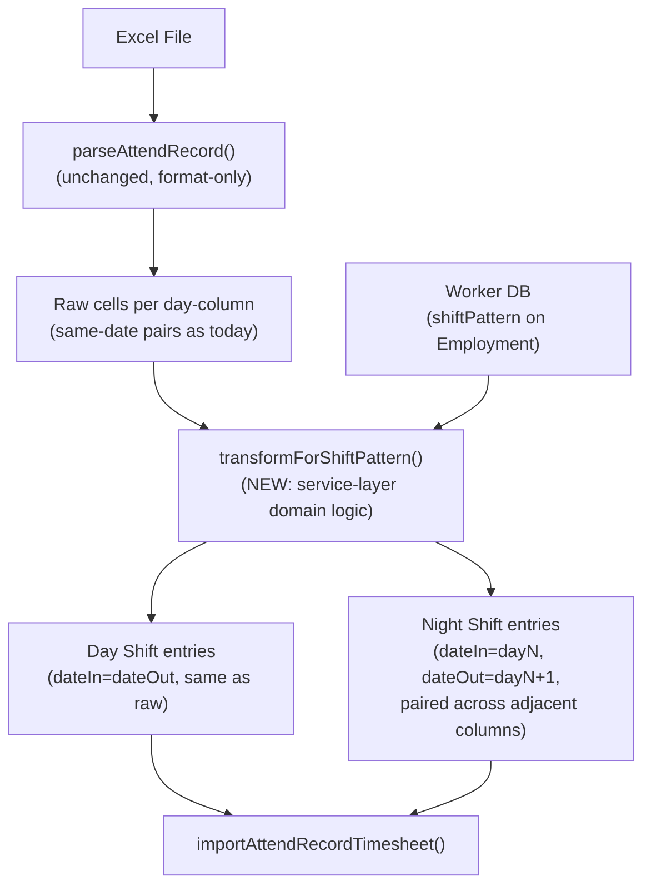

# Night Shift Timesheet Import Refactor

## Problem Statement

The AttendRecord import parser assumes all workers are on day shifts: each day-column cell contains `[timeIn]\n[timeOut]` on the same calendar date. Night shift workers have a fundamentally different cell layout:

- **Day shift cell:** Row 1 = time-in (today), Row 2 = time-out (today)
- **Night shift cell:** Row 1 = time-out (from yesterday's shift), Row 2 = time-in (for today's shift, ending tomorrow)

The system currently cannot distinguish these, causing validation errors (time-out before time-in) or incorrect 12-hour entries for night shift workers like Ashad.

## Solution

Add `shiftPattern` (`Day Shift` | `Night Shift`) to the Employment model, then implement a post-parse transformation in the service layer that re-pairs raw cell data into correct cross-midnight timesheet entries based on each worker's shift pattern.

## Architecture



## Key Design Decisions

1. **Parser stays pure** -- `parseAttendRecord` remains a dumb cell extractor. It outputs one entry per day-column cell with `dateIn === dateOut`. Shift-aware re-pairing is domain logic in the service layer.

2. **Night shift pairing rule:** For a night shift worker with raw entries for days 1..N:
    - Day 1: only has time-in (row 2 or row 1 if only one value). Pair with day 2's row 1 as time-out.
    - Day K (middle): row 1 is time-out for K-1's shift; row 2 is time-in for K's shift (time-out comes from K+1's row 1).
    - Day N (last): row 1 completes previous shift. If row 2 exists, that shift has no time-out (incomplete).

3. **Client-side preview** also needs shift-aware transformation so the editable table shows correctly paired entries before upload.

## Commits

### Commit 1: Add `shiftPattern` to schema and types

- Add `WORKER_SHIFT_PATTERNS = ["Day Shift", "Night Shift"] as const` to [`types/status.ts`](types/status.ts)
- Add `shiftPattern` column to [`db/tables/employmentTable.ts`](db/tables/employmentTable.ts) with default `"Day Shift"`
- Update the Zod schema in [`db/schemas/worker-employment.ts`](db/schemas/worker-employment.ts)
- Update `WorkerWithEmployment` type in [`db/tables/workerTable.ts`](db/tables/workerTable.ts) to include `shiftPattern`
- Run `npm run db:migrate` to push the new column

### Commit 2: Add shift pattern to worker form

- Add a shift pattern select field to [`app/dashboard/worker/worker-form.tsx`](app/dashboard/worker/worker-form.tsx)
- Update the worker create/update actions in [`app/dashboard/worker/actions.ts`](app/dashboard/worker/actions.ts) to persist `shiftPattern`
- Update worker loader in [`app/dashboard/worker/[id]/_shared/load-worker.ts`](app/dashboard/worker/%5Bid%5D/_shared/load-worker.ts) if needed

### Commit 3: Create the night-shift pairing transformation function (with tests)

- Create `services/timesheet/transform-night-shift-entries.ts` containing a pure function:
    ```typescript
    function transformNightShiftEntries(
        rawEntries: AttendRecordDate[],
        periodStartDate: string,
    ): AttendRecordDate[];
    ```
- The function takes raw same-date entries (as the parser outputs) and re-pairs them into cross-midnight entries
- Write thorough unit tests covering: normal pairing, first-day time-in only, last-day time-out only, incomplete entries, single-entry periods

### Commit 4: Wire shift pattern into the import service

- Update [`app/dashboard/timesheet/import/page.tsx`](app/dashboard/timesheet/import/page.tsx) to join `employmentTable` and pass `shiftPattern` alongside worker data
- Update `TimesheetImportWorker` type in [`app/dashboard/timesheet/import/worker-matching.ts`](app/dashboard/timesheet/import/worker-matching.ts) to include `shiftPattern`
- Update [`services/timesheet/import-attend-record-timesheet.ts`](services/timesheet/import-attend-record-timesheet.ts) to look up shift pattern per matched worker and call the transformation function before validation

### Commit 5: Wire shift-aware preview into the client UI

- Update [`app/dashboard/timesheet/import/timesheet-import-client.tsx`](app/dashboard/timesheet/import/timesheet-import-client.tsx) so `flattenForPreview` applies the night-shift transformation when the matched worker has `shiftPattern === "Night Shift"`
- The editable preview table will show correctly paired cross-midnight entries for night shift workers

### Commit 6: Update seed data and documentation

- Update [`db/seed/workers.ts`](db/seed/workers.ts) to assign `Night Shift` to relevant seeded workers
- Update [`UBIQUITOUS_LANGUAGE.md`](UBIQUITOUS_LANGUAGE.md) with **Shift pattern** term
- Update [`AGENTS.md`](AGENTS.md) if needed

## Key Files

- **Schema:** [`db/tables/employmentTable.ts`](db/tables/employmentTable.ts), [`types/status.ts`](types/status.ts)
- **Parser (unchanged):** [`utils/payroll/parse-attendrecord.ts`](utils/payroll/parse-attendrecord.ts)
- **New transformation:** `services/timesheet/transform-night-shift-entries.ts`
- **Import service:** [`services/timesheet/import-attend-record-timesheet.ts`](services/timesheet/import-attend-record-timesheet.ts)
- **Client UI:** [`app/dashboard/timesheet/import/timesheet-import-client.tsx`](app/dashboard/timesheet/import/timesheet-import-client.tsx)
- **Worker form:** [`app/dashboard/worker/worker-form.tsx`](app/dashboard/worker/worker-form.tsx)

## Testing Decisions

- The transformation function (`transformNightShiftEntries`) is the core logic and gets the most test coverage: edge cases around first/last days, incomplete entries, single-entry periods
- Prior art: tests in [`utils/payroll/parse-attendrecord.test.ts`](utils/payroll/parse-attendrecord.test.ts) and [`app/dashboard/timesheet/import/import-attend-record-timesheet.client.test.ts`](app/dashboard/timesheet/import/import-attend-record-timesheet.client.test.ts)
- Integration: the existing import service test structure can be extended with a night-shift worker scenario

## Out of Scope

- **Nullable time-out / incomplete entry handling** -- a separate issue; currently entries with missing time-out default to `23:59:59` and this behavior is preserved for now
- **Mixed shift patterns within a single period** -- workers don't alternate shifts within one import file
- **Payroll calculation changes** -- hours are already correctly computed from dateIn+timeIn to dateOut+timeOut via the Postgres generated column; no payroll logic changes needed
- **Rotating/split shifts** -- only Day Shift and Night Shift for now
