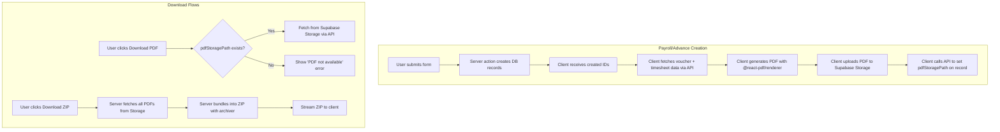

# PDF Storage System Refactor

## Problem Statement

The current PDF generation system uses Playwright/headless Chromium to navigate to the app's own summary pages and render them as PDFs on demand. This approach is unreliable -- the browser often captures the loading skeleton instead of the rendered content (the `waitUntil: "load"` event fires before async server component data resolves). It works intermittently in production (cached/fast payrolls render in time, slower ones don't) and is completely broken in development. It is also slow, requiring a full browser launch + page navigation for every single PDF.

## Solution

Replace the entire PDF pipeline with:

1. **React PDF (`@react-pdf/renderer`)** for client-side PDF generation -- no browser, no auth cookies, no timing issues
2. **Supabase Storage** for persistent PDF file storage -- generate once, download instantly
3. **Storage-backed downloads** -- single PDF downloads fetch directly from storage; ZIP downloads fetch all files from storage and bundle server-side

### Architecture Overview

## Key Design Decisions

### Storage

- **Supabase Storage bucket**: `documents` (private, auth-gated)
- **Path convention**: `payroll/{payrollId}/voucher.pdf` and `advance/{advanceRequestId}/voucher.pdf`
- **Schema change**: Add nullable `pdfStoragePath` text column to both `payrollTable` and `advanceRequestTable`
- Orphaned PDFs from deleted drafts are kept (no cascade delete from storage)

### Generation Triggers

- **Payroll**: PDF generated client-side immediately after batch creation. Progress dialog shown during generation + upload. Auto-downloads as ZIP from in-memory blobs while also uploading to storage in parallel.
- **Payroll draft edits**: Auto-regenerate and re-upload PDF after each save (period/date change recalculates voucher values).
- **Advance**: PDF generated client-side when the advance request is first created.

### PDF Templates (React PDF)

Three document templates need to be built using `@react-pdf/renderer` primitives (`Document`, `Page`, `View`, `Text`, `StyleSheet`):

1. **Payroll Payment Voucher + Summarized Timesheet** -- replicates the combined layout from [`payment-voucher.tsx`](app/dashboard/payroll/[id]/payment-voucher.tsx) and [`summarized-timesheet.tsx`](app/dashboard/payroll/[id]/summarized-timesheet.tsx)
2. **Advance Request Voucher** -- replicates the layout from [`advance-downloadable.tsx`](app/dashboard/advance/[id]/advance-downloadable.tsx)

### Download Flows

- **Single payroll PDF**: API route checks `pdfStoragePath`, fetches from Supabase Storage, returns as attachment. Shows error if no path.
- **Single advance PDF**: Same pattern as payroll.
- **Batch payroll ZIP**: Server-side API route fetches all PDFs from Supabase Storage (no Playwright), bundles with archiver, streams to client. Reuses the existing NDJSON progress streaming pattern.

### Old Records

- Payrolls/advances created before this change have no `pdfStoragePath` -- download shows "PDF not available" error
- The Playwright code (`services/pdf/`, `browser-manager.ts`) will be removed entirely

## Commits

### Phase 1: Foundation

1. **Add `@react-pdf/renderer` dependency** -- `npm install @react-pdf/renderer`

2. **Create Supabase Storage bucket and client helper** -- Add a `documents` bucket in Supabase. Create `lib/supabase/storage.ts` with helpers for uploading and downloading from the bucket using the service role client server-side and the user client for client-side uploads.

3. **Add `pdfStoragePath` column to `payrollTable`** -- Add nullable `text("pdf_storage_path")` column. Run `db:migrate`.

4. **Add `pdfStoragePath` column to `advanceRequestTable`** -- Same pattern. Run `db:migrate`.

### Phase 2: React PDF Templates _(done)_

5. **Create shared React PDF primitives** — Done. `services/pdf/react-pdf/primitives.tsx` (`DocumentShell`, `MetadataTable`, `SignatureSection`, shared table row styles).

6. **Build payroll payment voucher React PDF template** — Done. `services/pdf/react-pdf/payroll-voucher-document.tsx`.

7. **Build summarized timesheet React PDF template** — Done. `services/pdf/react-pdf/timesheet-document.tsx`.

8. **Build combined payroll PDF document** — Done. `services/pdf/react-pdf/payroll-pdf-document.tsx` (voucher page + timesheet page).

9. **Build advance request voucher React PDF template** — Done. `services/pdf/react-pdf/advance-voucher-document.tsx`.

Barrel: `services/pdf/react-pdf/index.ts`.

### Phase 3: Generation + Upload API _(done)_

10. **Create PDF data-fetching API route for payroll** — Done. `app/api/payroll/[id]/pdf-data/route.ts` (`GET`). Joins payroll + voucher + worker + timesheets, returns `PayrollPdfData` (pre-formatted period label and voucher date via `formatEnGbDmyNumericFromCalendar`).

11. **Create PDF data-fetching API route for advance** — Done. `app/api/advance/[id]/pdf-data/route.ts` (`GET`). Delegates to `getAdvanceRequestByIdWithWorker`, returns `AdvanceVoucherData`.

12. **Create PDF storage path update API routes** — Done. `app/api/payroll/[id]/pdf-storage-path/route.ts` and `app/api/advance/[id]/pdf-storage-path/route.ts` (`PATCH`). Accept `{ storagePath: string }`, update `pdfStoragePath` column. Auth-gated via `requireCurrentApiUser`.

13. **Create client-side PDF generation + upload utility** — Done. `lib/client/generate-and-upload-pdf.ts`. Exports `generateAndUploadPayrollPdf(payrollId)` and `generateAndUploadAdvancePdf(advanceRequestId)` — each fetches PDF data from the API, renders React PDF to blob via `pdf().toBlob()`, uploads to Supabase Storage, and persists the storage path. Returns `{ blob, storagePath }` for downstream use (e.g. client-side ZIP assembly).

### Phase 4: Payroll Creation Flow

14. **Update `createPayrollRecords` to return created payroll IDs** -- The current server action returns `{ success, created, skipped, conflicts }` but not the actual IDs. Add `createdPayrollIds: string[]` to the return type so the client can generate PDFs.

15. **Build PDF generation progress dialog** -- Reuse/adapt the existing `PayrollBulkZipProgressDialog` pattern for the payroll creation flow. Show "Generating PDFs..." with per-worker progress, elapsed time, and ETA.

16. **Update `PayrollForm` to generate PDFs after creation** -- After `createPayrolls` returns success, show the progress dialog, iterate over created payroll IDs generating + uploading PDFs, then auto-download the generated PDFs as a client-side ZIP (using the in-memory blobs).

17. **Add client-side ZIP assembly for post-creation download** -- Use `jszip` (or the `archiver` equivalent for browser) to bundle the in-memory PDF blobs into a ZIP and trigger download. This happens in parallel with the storage uploads.

### Phase 5: Download Flow Migration

18. **Update payroll single PDF download to use storage** -- Modify the `PayrollSummaryCapture` to check if `pdfStoragePath` exists, and if so, download directly from a new API route that fetches from Supabase Storage. Show "PDF not available" error if no path.

19. **Update advance single PDF download to use storage** -- Same pattern for `AdvanceSummaryCapture`.

20. **Update payroll ZIP download to use storage** -- Rewrite `download-zip/route.ts` to fetch PDFs from Supabase Storage instead of generating via Playwright. Keep the NDJSON progress streaming pattern. For payrolls without `pdfStoragePath`, skip with a failure entry in the ZIP error report.

21. **Update payroll PDF API route to serve from storage** -- Rewrite `app/api/payroll/[id]/pdf/route.ts` to fetch from Supabase Storage using `pdfStoragePath`. Return 404 JSON if no stored PDF.

22. **Update advance PDF API route to serve from storage** -- Same pattern for `app/api/advance/[id]/pdf/route.ts`.

### Phase 6: Draft Edit Auto-Regeneration

23. **Auto-regenerate payroll PDF on draft edit** -- After `updatePayroll` server action succeeds, the client regenerates the PDF with React PDF using updated data and re-uploads to storage, updating `pdfStoragePath`.

### Phase 7: Advance Creation Integration

24. **Generate advance PDF on creation** -- After the advance request form submits successfully, generate the PDF client-side and upload to storage. Show a brief loading indicator.

### Phase 8: Cleanup

25. **Remove Playwright PDF generation code** -- Delete `services/pdf/generate-pdf.ts`, `services/pdf/browser-manager.ts`, and their tests. Remove `@sparticuz/chromium` and `playwright-core` dependencies. Remove the old `pdf-export-handler.ts` shared handler.

26. **Remove unused print route query params** -- The `?print=1` query parameter pattern on summary pages is no longer needed for PDF generation. Clean up any print-specific conditional rendering if desired (or keep it for manual browser print).

27. **Update `AGENTS.md` and project docs** -- Document the new PDF storage architecture, the React PDF templates, the Supabase Storage bucket, and the updated API routes.

## Testing Decisions

### What makes a good test

Tests should verify external behavior (inputs/outputs) not implementation details. For React PDF templates, test that the document renders without crashing and contains expected text content. For upload/download flows, mock Supabase Storage and verify the correct paths and data are used.

### Modules to test

- **React PDF template components** -- Render tests verifying the documents produce valid output with sample data. Test edge cases like zero line items, missing optional fields, very long timesheet lists.
- **PDF generation + upload utility** -- Unit tests with mocked fetch and Supabase client, verifying the correct sequence of API calls and storage uploads.
- **Updated API routes** -- Tests for the storage-backed download routes (mock Supabase Storage), testing both the happy path and the "no PDF available" case.
- **ZIP download route** -- Tests verifying the storage-fetch + archiver bundling flow.

### Prior art

- Existing tests in `services/pdf/generate-pdf.test.ts` and `app/api/payroll/download-zip/helpers.test.ts` show the mocking patterns for the PDF pipeline.
- Route tests in `app/api/payroll/[id]/pdf/route.test.ts` and `app/api/advance/[id]/pdf/route.test.ts` show how API routes are tested.

## Out of Scope

- **Backfilling PDFs for existing/settled payrolls** -- Old records will show "PDF not available". A backfill migration can be done later if needed.
- **Supabase Storage bucket RLS policies** -- The bucket is private; access is gated through API routes. Fine-grained RLS can be added later.
- **PDF preview in the browser** -- The summary page still renders the voucher/timesheet as HTML for viewing; the PDF is only for downloads.
- **Advance PDF auto-regeneration on edit** -- Only payroll draft edits trigger PDF regeneration. Advance PDFs are generated once on creation.
- **Storage cleanup/garbage collection** -- Orphaned PDFs from deleted drafts are not cleaned up in this change.
- **Print-specific CSS cleanup** -- The `print:` Tailwind utilities on summary pages remain untouched.

## Further Notes

- `@react-pdf/renderer` uses its own layout engine (yoga) and primitives (`View`, `Text`, etc.), not HTML/CSS. The template rebuild is the largest piece of work. The existing shadcn Table components and Tailwind classes cannot be reused -- the templates must be written from scratch using React PDF's `StyleSheet.create()`.
- Client-side PDF generation with React PDF is fast (sub-second per document) compared to the Playwright approach (5-15 seconds per document including browser launch). This makes the post-creation progress bar much snappier.
- The `jszip` library (or similar) will be needed for client-side ZIP assembly during the post-creation auto-download flow. The server-side ZIP route continues using `archiver`.
