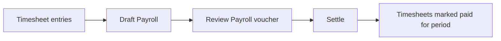
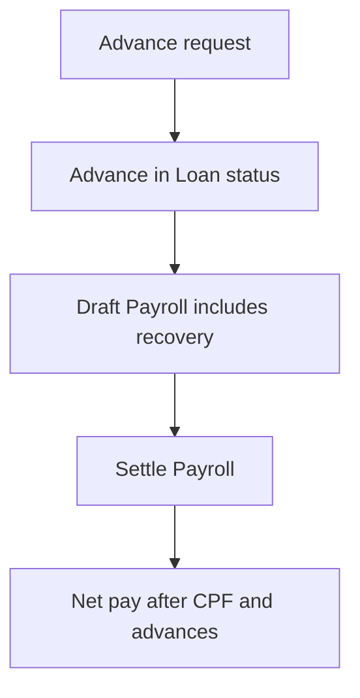
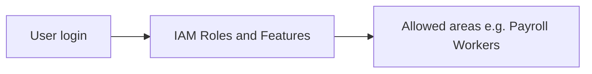
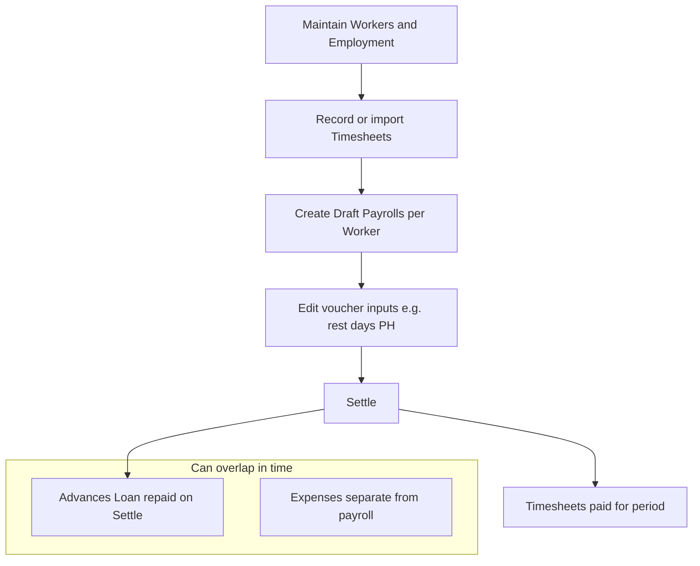
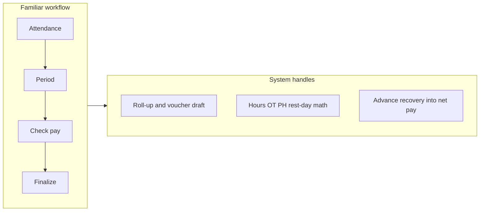

# Client demo script

## What you want them to feel

**Same job, less friction:** the steps mirror how they run payroll today (attendance → period → check numbers → finalize), but **repetitive data entry and re-keying are largely automated**. Close with: *“You still control **Settle** and the voucher inputs you care about; the system does the mechanical roll-up.”*

Internal **workforce payroll and back-office spend** only. **Customer-facing laundry** (orders, delivery) is explicitly **out of scope** for this app—say that once up front so expectations stay aligned with [UBIQUITOUS_LANGUAGE.md](./UBIQUITOUS_LANGUAGE.md).

**Login:** `/login` — use a seeded admin user in your environment (e.g. Playwright defaults `root` / `root1234` if that matches your seed).

### Automation to call out (pick 2–3 live)

| Today (often manual) | In the app |
|----------------------|------------|
| Re-type clock data row by row | **Import timesheets** where applicable; **Hours** from **Time in** / **Time out** (including overnight) |
| Rebuild pay from spreadsheets | **Draft Payroll** pulls **Timesheet entries** in the **Pay period** and **Employment** rules into a **Payroll voucher** |
| Track advances in a side ledger | **Advance** in **Loan** status flows into **Net pay** on **Settle** without re-entering the balance each run |
| Re-enter payout details each time | **Payment method** and identifiers live on **Employment** and copy through to the voucher |

---

## Demo case 1 — From attendance to a settled payroll

**Story:** A **Worker** has **Timesheet entries** in a **Pay period**; you run a **Draft** **Payroll**, review the **Payroll voucher**, then **Settle**.

**Framing:** *“This is the same sequence you already use—only the tedious parts are filled in for you.”*

**Steps (concise):**

1. **Worker** → open a worker with **Employment** set (or show **All workers**). **Time saved:** rates, **CPF**, **minimum hours**, and payout rules live in one place instead of scattered notes.
2. **Timesheet** → **All timesheets** (or **Import timesheets** if you demo import). **Time saved:** **Hours** computed from in/out; stress **included in payroll** only after **Settle**—no double-paying the same period by accident.
3. **Payroll** → **New payroll** or open an existing **Draft** for that worker and period. **Time saved:** the **Payroll voucher** is built from **Employment**, period **Timesheet entries**, and open **Advances**—you review and adjust, not retype from a spreadsheet (drafts stay in step with saves on those areas).
4. On the run: adjust **Rest days** / **Public holidays** on the voucher—*explicitly* “the bits you still decide,” same as today’s judgment calls.
5. **Settle** — **Timesheet** lines in that period move to **paid** / “included in payroll” semantics; voucher is frozen.

---

## Demo case 2 — Salary advance and recovery

**Story:** A **Worker** submits an **Advance request**; an **Advance** in **Loan** status is recovered on the next **Settled** **Payroll** (reduces **Net pay**).

**Framing:** *“You still approve advances the way you do now; you stop manually subtracting them from every pay calculation.”*

**Steps:**

1. **Advance** → **New advance** (or **All advances**) — request + disbursement line.
2. **Payroll** → open **Draft** for same **Worker** — show recovery on the **Payroll voucher** and **Net pay** without re-keying the loan balance.
3. **Settle** — linked **Advance** moves toward **paid** when fully recovered (use domain wording: **Settled** for payroll, **paid** for advance repayment).

---

## Demo case 3 (optional, ~1 min) — Shop spend or access

**Framing:** *“Less duplicate entry for shop spend; less ‘who changed the numbers?’ for payroll access.”*

Pick one:

- **Expenses** — overhead line items (not allocated to a **Worker** or **Payroll**).
- **IAM** — **Users**, **Roles**, **Features** (who can open **Payroll** / **Workers**).

---

## End-to-end picture (only if the client asks for “the whole month”)

**Framing:** same linear mental model as a manual month-end; the middle column is what used to be spreadsheets and re-entry.

---

## Language cheat sheet (while clicking)

| Say this | Avoid mixing |
|----------|----------------|
| **Settled** for a finalized **Payroll** | “Settled” for **Advance** repayment |
| **Included in payroll** for timesheet state after **Settle** | Bare **Paid** on timesheets (confuses with **Advance** **paid**) |
| **Worker** in ops UI; **Employee** on formal advance copy if your UI uses it | Treating **User** and **Worker** as the same thing |
